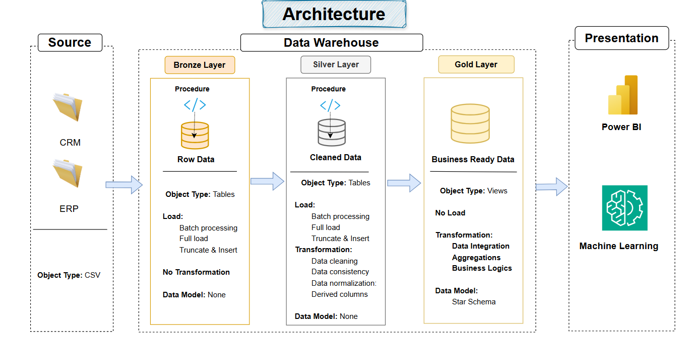

# SQL-DataWarehouse-Medallion-Architecture-Project
A comprehensive Modern Data Architecture project using Medallion Architecture principles — Bronze, Silver, and Gold layers — built on Microsoft SQL Server with robust ETL pipelines, data integration, and data lineage tracking.
---
## 📖 Project Overview

This project demonstrates how to build a scalable and maintainable Data Warehouse using:

✅ Medallion Architecture (Bronze → Silver → Gold)
✅ T-SQL ETL Pipelines
✅ Data Integration from multiple source systems
✅ Data Lineage to track data transformations and dependencies
✅ Star Schema Modeling for BI and analytics

🏗️ Medallion Architecture

The architecture for this project follows Medallion Architecture **Bronze**, **Silver**, and **Gold** layers:

🥉 Bronze Layer
Stores raw, unprocessed data directly ingested from source systems.
Data Source: CSV files from ERP and CRM systems.
Acts as a data landing zone.

🥈 Silver Layer
Performs data cleansing, type conversion, standardization, and deduplication.
Joins and enriches data across source systems.
Provides clean, business-conformed data ready for modeling.

🥇 Gold Layer
Contains business-ready data modeled using a star schema (fact and dimension tables).
Optimized for reporting, dashboards, and advanced analytics.

## ETL Pipelines 
This process include: Extracting, transforming, and loading data from source systems into the warehouse.

## Data Modeling 
Create Star Schema by developing fact and dimension tables optimized for analytical queries.

---
#### Objective
Develop a modern data warehouse using SQL Server to consolidate sales data, enabling analytical reporting and informed decision-making.

#### Specifications
- **Data Sources**: Import data from two source systems (ERP and CRM) provided as CSV files.
- **Data Quality**: Cleanse and resolve data quality issues prior to analysis.
- **Integration**: Combine both sources into a single, user-friendly data model designed for analytical queries.
- **Scope**: Focus on the latest dataset only; historization of data is not required.
- **Documentation**: Provide clear documentation of the data model to support both business stakeholders and analytics teams.

---

