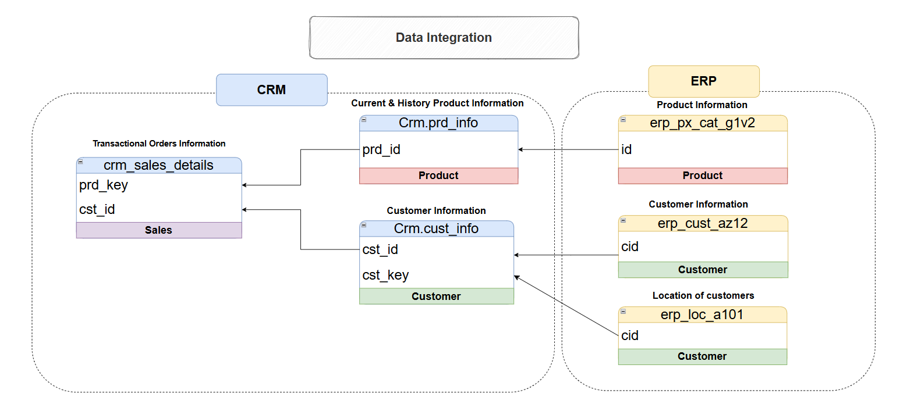

# SQL-DataWarehouse-Medallion-Architecture-Project
A comprehensive Modern Data Architecture project using Medallion Architecture principles 
- Bronze, Silver, and Gold layers
- built on Microsoft SQL Server with robust ETL pipelines, data integration, and data lineage tracking.

## 📖 Project Overview

This project demonstrates how to build a scalable and maintainable Data Warehouse using:

- Medallion Architecture (Bronze → Silver → Gold)
- T-SQL ETL Pipelines
- Data Integration from multiple source systems
- Data Lineage to track data transformations and dependencies
- Star Schema Modeling for BI and analytics

🏗️ Medallion Architecture

  The architecture for this project follows Medallion Architecture **Bronze**, **Silver**, and **Gold** layers:

🥉 Bronze Layer
- Stores raw, unprocessed data directly ingested from source systems.
- Data Source: CSV files from ERP and CRM systems.
- Acts as a data landing zone.

🥈 Silver Layer
- Performs data cleansing, type conversion, standardization, and deduplication.
- Joins and enriches data across source systems.
- Provides clean, business-conformed data ready for modeling.

🥇 Gold Layer
- Contains business-ready data modeled using a star schema (fact and dimension tables).
- Optimized for reporting, dashboards, and advanced analytics.

🔁 ETL Pipelines 
This project implements custom ETL pipelines using T-SQL:
- Extract: Load raw data from CSV files into the Bronze layer.
- Transform: Clean, standardize, and join data in the Silver layer.
- Load: Populate analytical models and aggregated tables in the Gold layer.

🧩 Data Integration
- Combines data from ERP (e.g., orders, customers) and CRM (e.g., leads, accounts).
- Uses keys, matching logic, and business rules to integrate datasets into unified entities.
- Enables a 360-degree view of customer and sales performance.
- 

## Data Modeling 
Create Star Schema by developing fact and dimension tables optimized for analytical queries.

---
#### Objective
Develop a modern data warehouse using SQL Server to consolidate sales data, enabling analytical reporting and informed decision-making.

#### Specifications
- **Data Sources**: Import data from two source systems (ERP and CRM) provided as CSV files.
- **Data Quality**: Cleanse and resolve data quality issues prior to analysis.
- **Integration**: Combine both sources into a single, user-friendly data model designed for analytical queries.
- **Scope**: Focus on the latest dataset only; historization of data is not required.
- **Documentation**: Provide clear documentation of the data model to support both business stakeholders and analytics teams.

---

