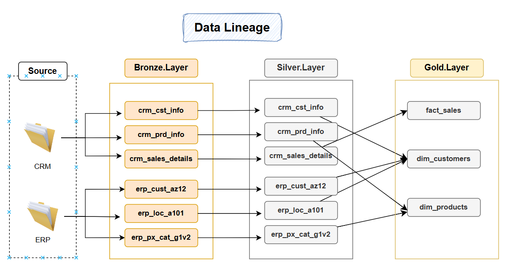

# SQL-DataWarehouse-Medallion-Architecture-Project
A comprehensive Modern Data Architecture project using Medallion Architecture principles 
- Bronze, Silver, and Gold layers
- built on Microsoft SQL Server with robust ETL pipelines, data integration, and data lineage tracking.

## 📖 Project Overview

This project demonstrates how to build a scalable and maintainable Data Warehouse using:

- Medallion Architecture (Bronze → Silver → Gold)
- T-SQL ETL Pipelines
- Data Integration from multiple source systems
- Data Lineage to track data transformations and dependencies
- Star Schema Modeling for BI and analytics

🏗️ Medallion Architecture

  The architecture for this project follows Medallion Architecture **Bronze**, **Silver**, and **Gold** layers:

🥉 Bronze Layer
- Stores raw, unprocessed data directly ingested from source systems.
- Data Source: CSV files from ERP and CRM systems.
- Acts as a data landing zone.

🥈 Silver Layer
- Performs data cleansing, type conversion, standardization, and deduplication.
- Joins and enriches data across source systems.
- Provides clean, business-conformed data ready for modeling.

🥇 Gold Layer
- Contains business-ready data modeled using a star schema (fact and dimension tables).
- Optimized for reporting, dashboards, and advanced analytics.

🔁 ETL Pipelines 
This project implements custom ETL pipelines using T-SQL:
- Extract: Load raw data from CSV files into the Bronze layer.
- Transform: Clean, standardize, and join data in the Silver layer.
- Load: Populate analytical models and aggregated tables in the Gold layer.

🧩 Data Integration
- Combines data from ERP (e.g., orders, customers) and CRM (e.g., leads, accounts).
- Uses keys, matching logic, and business rules to integrate datasets into unified entities.
- Enables a 360-degree view of customer and sales performance.
  

🔎 Data Lineage
- Full visibility of data flow from source to different layers.

📐 Data Modeling 
- Create Star Schema by developing fact and dimension tables optimized for analytical queries.
- Fact Tabe: Sales table
- Dimenstions Tables: Product, Customer

🎯 Project Objectives
- Build a modern SQL-based data warehouse.
- Ingest and integrate data from multiple CSV-based systems.
- Apply data quality, standardization, and modeling best practices.
- Deliver a query-ready, business-friendly model.

#### Specifications
| Category             | Details                                                               |
| -------------------- | --------------------------------------------------------------------- |
| **Data Sources**     | CSV files from ERP and CRM systems                                    |
| **Platform**         | Microsoft SQL Server                                                  |
| **ETL**              | Custom T-SQL scripts and procedures                                   |
| **Data Quality**     | Handled in Silver Layer: deduplication, type casting, standardization |
| **Data Integration** | Unified view combining ERP and CRM customer data                      |
| **Scope**            | Latest data only (no historization required)                          |
| **Lineage**          | Structured ETL layers with transformation traceability                |
| **Documentation**    | Architecture diagrams, schema documentation, and ETL logic            |

🙋‍♂️ Author
- [Mona Rizq]
- Data & Analytics Engineer
